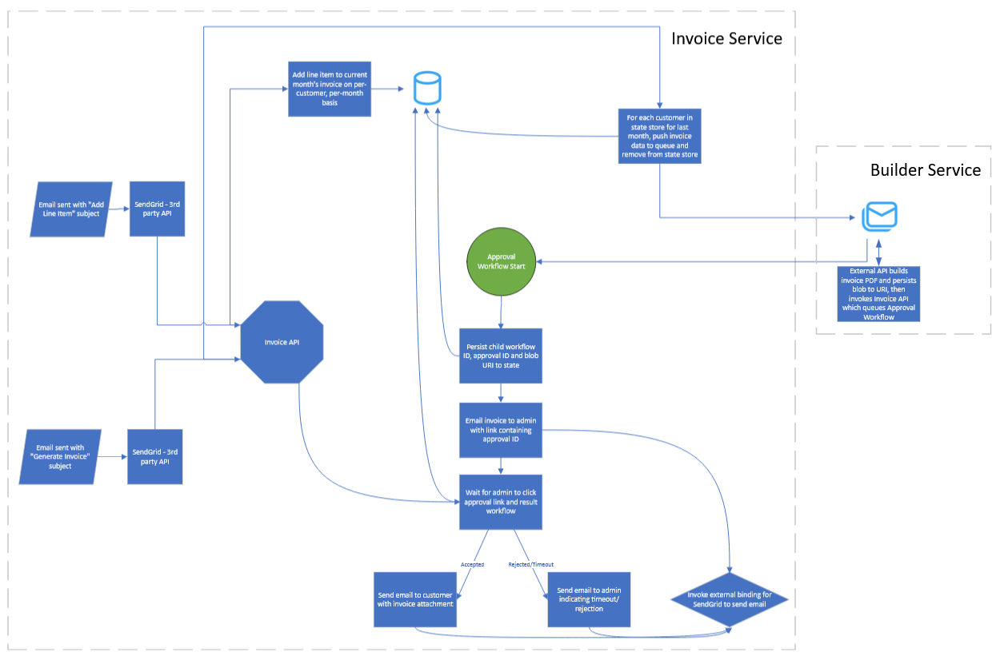

# Invoicer

Invoice Service

Builder Service

This project describes an open source solution submitted for [Diagrid's AWS Hackathon](https://www.diagrid.io/blog/innovate-and-win-its-the-diagrid-catalyst-aws-hackathon) and is made
available in accordance with the [rules](https://22146261.fs1.hubspotusercontent-na1.net/hubfs/22146261/Catalyst%20Hackathon/Diagrid%20Catalyst%20AWS%20Hackathon%20Rules.docx.pdf)
to the public under an MIT license.

Note that while the project itself is released under an MIT license, this license does not extend to the various third-party components used. They are governed by their own
licenses. While the providers of these third-party tools might offer open source licenses for their use, I utilized paid licenses for each. The license keys are, of course,
not available in this repository and are loaded into the project via environment variables. While these will be discussed below and the various providers may offer
some sort of open source license, an absence of the proivded license keys may result in you being unable to run the solution in its entirety, so be forewarned.

## Project Description
At the beginning of each month, it's my responsibility as a small business owner to generate and send out invoices to each of my customers reflecting the work I did for them,
the cost to the customer for this work and related information to assist them in paying the invoiced total. While there are a number of third-party services that offer turnkey invoicing
and billing systems that'll facilitate this, they frequently charge a percentage of the billed amount for the privilege. Producing and submitting the invoices manually can
really save a meaningful amount of money.

This project is called Invoicer and does precisely that. It's a simple proof-of-concept solution for maintaining line items of performed work on a per-customer basis and
then ultimately generating an invoice containing all the items registered since the last invoice was generated. The invoice proof is sent to the "administrator" for verification and,
if approved, then sent in a separate email to the customer (with a bcc to the "administrator" for their records).

## Technologies Utilized
The following technologies were utilized in the development of this application.

| Name | Description |
| --- | --- |
| Diagrid Catalyst Pub/Sub | Used for queueing generation requests and signalling completed file builds |
| Diagrid Catalyst Key/Value Store | Used to temporarily store invoice data between invoice generations |
| Diagrid Catalyst Workflow | Facilitates the operation kicked off by the invoice generation command to handle generation, approval and invoice submission |
| Azure Storage via Diagrid Catalyst Store Binding | Used to store generated invoices for ongoing persistence |
| [SendGrid](https://sendgrid.com/en-us) via Diagrid Catalyst Output HTTP Binding | This solution uses both the inbound parsing mechanism and the outbound email API |
| [Syncfusion File Formats](https://www.syncfusion.com/document-processing-libraries) | Used to manipulate a Word file and produce a PDF output |
| .NET 8 using ASP.NET Core Web API | Developed locally using Aspire, but reomved in favor of Docker to publish to AWS. |

The goal behind this concept was simply to utilize as many of Diagrid's Catalyst components as possible to get a solid feel for their ease of use and capabilities.

## Architecture
The solution spans two microservices implemented in .NET 8 as Web API projects:
- Invoice Service
- Builder Service

Here is a high-level architectural diagram detailing the operation, but we'll go through it step-by-step below:

### Invoice Service
This is the primary service comprising the solution. While in a more real-world solution, it would probably be split up into multiple pieces, I didn't take that approach here.
Because my biggest focus of entering this hackathon was to try out the Catalyst services, I wanted to actually put most of the functionality in this one project to get a sense of
what sort of latency and memory usage might be incurred by having such a "heavy" service in place.

You'll note that there is no website in this solution. This is be design - don't you hate it when you have to remember yet another web address, set up another username/password to sign
in and have to learn a whole new UI just to do something relatively simple? I do. 

In this solution, you can do two things:
- Add line items assigned to specific customers
- Generate all invoices for each customer with at least one line item

Either command is submitted not via a website, but by sending an email. The subject line controls the command executed and the email body is parsed against an expected formatting
layout to understand the specifics of the command. The available commands (not case-sensitive) are as follows:

| Subject | Body Format |
| -- | -- |
| Add Line Item | Table formatted with headers: CustomerId, Quantity, Description, UnitPrice, Total |
| Generate Invoice | No body necessary - generates invoices for any customer with at least one line item |

I was experiencing a problem with ASP.NET Core and how it parses the form body from inbound email requests, so while I was originally validating the From field from an inbound email
and rejecting commands from all but the "administrator" email configured in an environment variable, this approach has changed. Instead, the body of the email must contain the text
"code={verificationCode};" somewhere in there in a way that doesn't impact the expected formatting.

If an email is received that doesn't contain the correct verification code or does, but the command cann't be discerned from the subject, it'll be logged and ignored.

#### Email-driven Commands

##### Add Line Item command
This command can accept more than one line item at a time and not all of them have to be associated with one customer. The body simply needs to provide, at a minimum, the verification
code and a table with the following content. Note that the headers need to be present, but it's not necessary that their text match precisely as the row is merely dropped when parsed.
Only column order and the data type matters:

| Column Name | Data Type | Description | Example |
| -- | -- | -- |
| Customer Id | Guid | In a production app, we'd store customer data in a database and look it up, but here we just have a lookup table with two customers. | e4cd5381-e822-4f1b-a991-4e78b4bfb717 |
| Quantity | String | Contains the quantity - this might be a number like "3" or include some unit of measure like "9 hours"; it's not parsed. | 10 hours |
| Description | String | A value providing a description for the work done being written on the line item. | Web Development |
| UnitPrice | String | Describes how the quantity is charged per unit. Again, this isn't parsed, so put whatever you want. | $100/hour |
| Total | Decimal | This is parsed as a currency-styled decimal value and is parsed as a number. | $6,913.42 |

If a line can't be parsed for whatever reason, it'll simply be skipped.

Parsed line items are persisted to the Diagrid key/value store. A separate key is used to store data for each customer and it's retrieved whenever data is being persisted and rotated whenever all
the line item values are retrieved for invoice generation. Because the idea is that invoices would be generated once every month, all line item data is saved alongside a 90-day TTL for audit
purposes.

##### Generate Invoice command
This command can accept more than one line at a time in the table. There should be only one column marked "CustomerId" and each row should contain a Guid matching the identifier of
a customer for which an invoice should be generated. Note that despite being present in the command email, if a customer identifier doesn't match any persisted line item
values, an invoice will not be generated for it. Otherwise, this email also needs the verification code alongside the table.

| Column Name | Data Type | Description | Example |
| -- | -- | -- | -- |
| Customer Id | Guid | The identifier of the customer to generate an invoice for (if there are any matching line items). | e4cd5381-e822-4f1b-a991-4e78b4bfb781 |

For each retrieved customer with a valid mapping, an event will be published to the appropriate pub/sub endpoint with the invoice payload for generation to be picked up by the Builder Service.

### Invoice Generation
Once the event has been received from the pub/sub queue indicating that the invoice has been generated and persisted to blob storage, This initiates a workflow that retrieves the data from the blob
state via Dapr and emails it via a Dapr outbound HTTP binding and the associated metadata to the administrator pending their sign-off and approval.

If the invoice is denied or the administrator takes more than 3 days to get to it and the approval times out, a follow-up email will be sent (again, via the Dapr outbound HTTP binding to the 
administrator confirming the invoice rejection.

If the invoice is approved, an email (once more, using the Dapr outbound HTTP binding) will be sent to the customer with the attached invoice and the administrator will be blind carbon copied for 
their own records.

### Builder Service
This is a relatively simple service compared to the other one. It listens to a pub/sub queue and upon an event triggering the listening method, it loads a copy of a Word document that serves as a template
into memory, manipulates it to insert the parsed invoice raw and calculated values (e.g. sales tax and the sum total) then renders the resulting document out to a PDF file. This is written out to
Azure via the Dapr key/value binding with Azure Storage and the metadata about it is written out to another pub/sub queue which the Invoice Service is listening to.

## How might I configure this solution?
Put simply, this won't work fully without having an account with the following services to obtain the necessary API and license keys:

| Service Name/Link | Purpose | Notes |
| -- | -- | -- |
| [SendGrid](https://www.sendgrid.com) | Used to both send and receive/parse emails | I believe there's a free tier offered, but you'd have to check with them |
| Domain | You'll need a domain to receive the inbound mail from SendGrid | The domain needs to be configured in SendGrid and in the environment variables so the approval/rejection links go back to the service. You'll also need to set up MX records to make it work with SendGrid |
| [Syncfusion File Formats](https://www.syncfusion.com/document-processing-libraries) | | Handles document insertion and PDF conversion | This will work without a license key, but will place watermarks on the PDF |
| Diagrid Catalyst Account | If you don't have access to Catalyst, the whole solution is compatible with a fully-featured Dapr instance, but you'll need to set up the various component files to configure all the bindings |
| Azure Storage account | I use Azure Storage as the blob store for this solution as the file is too large to put in a pub/sub event, but you can use whatever Dapr-compatible store you want |

There are a collection of environment variables you'll need to set for either service. Primarily, these allow the application to be configured without putting a bunch of confidential values into the source code. Note
that all the environment variable names need to be prefixed with the value "catalyst_" or they'll be overlooked during initialization. I exclude the prefix below, but make sure it's there for your setup.

### Invoice Service
The following variables should be specified on the Invoice Service. The application could be rewritten to avoid using some of them if you're not using Diagrid's service and whatnot, but that's outside the scope of this 
guide.

| Environment Variable Name | Description | Sample Value |
| -- | -- | -- |
| ADMIN_EMAIL_ADDRESS | The administrator's email address | admin@example.com |
| FROM_EMAIL_ADDRESS | The email address to send the emails from | admin@example.com |
| CUSTOMER_EMAIL_ADDRESS | The email address of the customer - typically this would be pulled from the customer records, but as this is a POC and not actually in-use, I just make it a constant here | customer@example.com |
| EMAIL_VALIDATION_CODE | This is the "password" used in the body of emails to authenticate them | abc123abc123abc123abc123 |
| FROM_EMAIL_NAME | The name to use in the email address to indicate the name of the pseron it's being sent from | Administrative User |
| DAPR_HTTP_ENDPOINT | The HTTP endpoint to use for the Diagrid Catalyst service | https://http-abc123.api.diagrid.io |
| DAPR_GRPC_ENDPOINT | The GRPC endpoint to use for the Diagrid Catalyst service | https://grpc-abc123.api.diagrid.io |
| DAPR_INVOICE_API_TOKEN | The API token used by the Dapr client to authenticate to the Diagrid Catalyst service | abc123abc123abc123 |
| API_BASE_DOMAIN | The domain used by the Invoice Service in the workflow approval/rejection links | https://invoicer.example.com |

### Builder Service
The following environment variables should be specified on the Builder Service. The application could be rewritten to avoid using some of them if you're not using Diagrid's service and whatnot, but that's outside the
scope of this guide.

| Environment Variable Name | Description | Sample Value |
| -- | -- | -- |
| DAPR_HTTP_ENDPOINT | The HTTP endpoint to use for the Diagrid Catalyst service | https://http-abc123.api.diagrid.io |
| DAPR_GRPC_ENDPOINT | The GRPC endpoint to use for the Diagrid Catalyst service | https://grpc-abc123.api.diagrid.io |
| DAPR_BUILDER_API_TOKEN | The API token used by the Dapr client to authenticate to the Diagrid Catalyst service | abc123abc123abc123 |
| SYNCFUSION_LICENSE_KEY | The license key used by the Syncfusion service to register the file formats SDK | abc123abc123abc123 |

## How might I deploy this solution?
This is deployed through an Azure DevOps solution running on a private build server. This server has the following tools installed:
- Visual Studio 2022 Professional (latest version)
- Docker Desktop Community Edition
- Azure DevOps Agent
- PowerShell
- AWS CLI v2

The build markup is in the repository - there's one configured for each service. Per the rules of this hackathon, this must be deployed to AWS. As such, the following services are deployed in AWS:
- Amazon Elastic Container Registry (2x - one for either service)
- Amazon App Runner (2x - one for either service)

Per the build markup, the docker images are built, tagged and pushed to ECR whenever new code is pushed to the repository for either services' path. Either App Runner service is configured to redeploy when a
new image is pushed to the associated ECR registry.

I'd recommend simply doing the same. I've implemented this simply using plain scripts, so there's no reason you can't just run them locally if you prefer. Just make sure you authenticate with the AWS CLI as this step
has already been done on the build servers and isn't done in this script. You'll need a short-lived credential with an access key ID, a secret key and the region you want to deploy to, then execute `aws configure` to set
each when prompted.